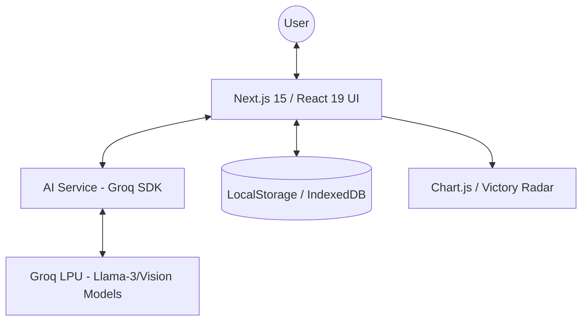

# VernaVitality: AI-Powered Metabolic Intelligence & Calorie Tracking


**VernaVitality** is a cutting-edge, privacy-first metabolic intelligence platform. Designed for the futuristic "Neural Core" aesthetic, it leverages ultra-fast AI inference via Groq to provide instantaneous nutritional analysis from text descriptions and images.

---

## 🏛 Architecture Overview

The system is built on a "Privacy-First" local architecture. All biological data points, meal histories, and personal goals are stored exclusively within the user's browser, ensuring total data sovereignty.



### 🧠 The "Neural Core" Engine
The core logic resides in `lib/ai.ts`, facilitating:
- **Multimodal Processing**: Seamless switching between text and vision models.
- **Goal Alignment**: Real-time analysis of nutritional intake against user-defined fitness visions.
- **Victory Radar**: Dynamic visualization of progress towards daily metabolic targets.

---

## ✨ Key Features

- **🚀 Sub-Second AI Analysis**: Powered by Groq's LPU technology for near-instant calorie and macronutrient breakdown.
- **📸 Vision Intelligence**: Take a photo of your meal for automatic recognition using Llama 4 Vision models.
- **🛡 100% Privacy**: No cloud database. All data persists in your browser's LocalStorage and IndexedDB.
- **📊 Advanced Analytics**: Visual metabolic telemetry tracking weight trends and victory streaks.
- **🥗 Smart Recommendations**: AI-driven "Winning Strategy" that suggests next meals to balance your daily intake.
- **📱 PWA Ready**: Install VernaVitality as a native-feel application on mobile and desktop.
- **💾 Data Portability**: Full JSON export and import capabilities for your health data.

---

## 🛠 Tech Stack

- **Framework**: [Next.js 15](https://nextjs.org/) (App Router)
- **Library**: [React 19](https://react.dev/)
- **Styling**: [Tailwind CSS 4](https://tailwindcss.com/) with Glassmorphism
- **AI Integration**: [Groq SDK](https://console.groq.com/)
- **Charts**: [Chart.js](https://www.chartjs.org/)
- **Icons**: [React Icons](https://react-icons.github.io/react-icons/)
- **State Management**: React Context & Hooks

---

## 🚀 Getting Started

### Prerequisites

- Node.js 18+
- A Groq API Key ([Get one here](https://console.groq.com/keys))

### Installation

1. Clone the repository:
   ```bash
   git clone git@github.com:Saravanan2005real/VernaVitality-AI-Powered-Metabolic-Intelligence-Calorie-Tracking.git
   ```

2. Install dependencies:
   ```bash
   npm install
   # or
   pnpm install
   ```

3. Start the development server:
   ```bash
   npm run dev
   ```

4. **Configuration**:
   - Open the application in your browser (`http://localhost:3000`).
   - Navigate to the **Profile/Settings** section.
   - Enter your **Groq API Key** to activate the AI features.

---

## 🔒 Security & Privacy

This project follows a strict zero-knowledge architecture:
- **No API keys are stored on a server.**
- **No meal data is uploaded to a database.**
- **AI processing happens via direct browser-to-Groq-API communication.**

---

## 📜 License

Created by **Saravanan** | © 2026 VernaVitality Systems.
Proprietary software structure with focus on open-source community benefits.
